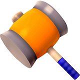

# Whack-A-Mole Game

A classic arcade-style Whack-A-Mole game with leaderboard functionality using PHP and MySQL for score tracking.



## Features

- Three difficulty levels (Easy, Medium, Hard)
- Customizable game settings:
  - Mole speed
  - Game duration
  - Sound controls
- Persistent leaderboard using MySQL database
- Responsive design for different screen sizes

## Demo


## Installation

### Prerequisites

- Web server with PHP support (Apache/Nginx)
- MySQL database
- PHP 7.0 or higher

### Setup

1. **Set up the database**
   - Create a MySQL database for the game
   - Import the database schema using the SQL script in `database/setup.sql`
   ```sql
   CREATE DATABASE IF NOT EXISTS whack_a_mole;
   USE whack_a_mole;
   CREATE TABLE IF NOT EXISTS scores (
       id INT AUTO_INCREMENT PRIMARY KEY,
       player_name VARCHAR(50) NOT NULL,
       score INT NOT NULL,
       difficulty TINYINT NOT NULL,
       date_created TIMESTAMP DEFAULT CURRENT_TIMESTAMP
   );
   ```

2. **Configure database connection**
   - Open `php/db_connection.php`
   - Update database credentials with your MySQL settings:
   ```php
   $db_host = 'localhost';  // Your database host
   $db_user = 'root';       // Your database username
   $db_pass = '';           // Your database password
   $db_name = 'whack_a_mole'; // Your database name
   ```

3. **Deploy to your web server**
   - Copy all files to your web server's document root (e.g., `/var/www/html/` or `htdocs/`)
   - Ensure proper permissions for the files (typically 644 for files and 755 for directories)

4. **Access the game**
   - Navigate to the game URL in your web browser (e.g., http://localhost/whack-a-mole/)

## Project Structure

```
whack-a-mole/
│
├── index.html           # Main HTML game file
│
├── css/                 # CSS and graphic assets
│   ├── style.css        # Main stylesheet
│   ├── hole.png         # Hole graphic
│   ├── mole.png         # Mole graphic
│   ├── hammer.png       # Hammer graphic
│   ├── background.jpg   # Background image
│   └── ...              # Other graphical assets
│
├── js/                  # JavaScript files
│   └── script.js        # Main game logic
│
├── php/                 # PHP backend scripts
│   ├── db_connection.php # Database connection config
│   ├── save_score.php   # Script to save scores
│   └── get_scores.php   # Script to retrieve scores
│
└── database/            # Database setup files
    └── setup.sql        # Database schema
```

## How to Play

1. Select a difficulty level: Easy, Medium, or Hard
2. Click "START" to begin the game
3. Click on the moles as they appear to score points
4. Try to hit as many moles as possible before the timer runs out
5. Enter your name to save your score to the leaderboard

## Game Mechanics

- **Difficulty Levels:**
  - Easy: Slower mole speed, 30 seconds game time
  - Medium: Normal mole speed, 10 seconds game time
  - Hard: Fast mole speed, 5 seconds game time

- **Scoring:**
  - Each successful hit on a mole earns 1 point
  - The leaderboard displays the top 8 highest scores

## Settings

You can customize various game settings:
- **Mole Speed:** Changes how quickly moles appear and disappear
- **Game Duration:** Changes the length of each game round
- **Sound:** Toggle game sounds on/off

## Troubleshooting

- **No moles appearing:** Ensure JavaScript is enabled in your browser
- **Cannot save score:** Check your PHP and MySQL setup
- **Sound not working:** Ensure your browser supports audio playback